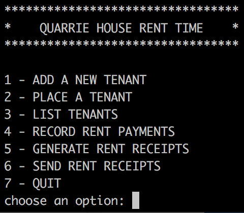

# Tenant Rental Management

Hello there. This is a little command line program I made to help me manage the [Quarrie House](https://youriguide.com/9b882_54_grand_ave_n_cambridge_on/).

## Getting Started

Clone the repo, and cd into the folder.

You will need to import the database:
cat database/QuarrieRental.sql | sqlite3 QuarrieRental.db

Next, if you want the email functionality to work, you will need to set your own variables for sending information. This can be done on the command line:
`export SCRIPT\_MAIL='youremail@gmail.com`
`export SCRIPT\_PASSWORD='yourpassword`

You can check that these have been set properly by typing `env` on unix.

Lastly, if you want to include a signature on the rental receipts, you will create and place a file as `resources/signature.png`

## Running the Program

To run the program, simply type `python3 app/app.py` from the root directory.

## Testing

The tests live in the 'tests' folder. To run all the test, from the home directory run:
`python3 -m unittest discover -s tests`

or to run a specific test file:
`python3 -m unittest tests.[filename] -v`

## Built With

* [Python3](https://www.python.org/downloads/)
* [SQlite](https://www.sqlite.org/index.html)
* [ReportLab](https://www.reportlab.com/docs/reportlab-userguide.pdf)
